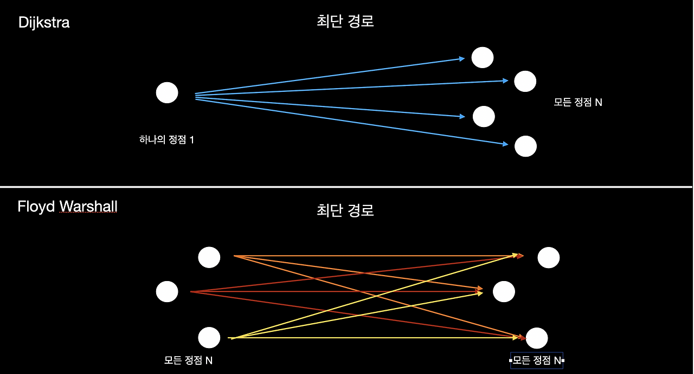
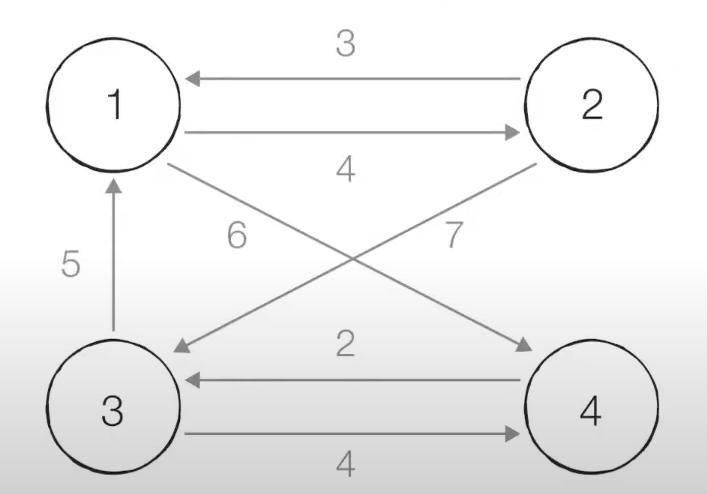

## 플로이드 워셜 (Floyd-Warshall) 

플로이드 워셜은 다익스트라와 동일하게 최단거리를 구하는데 사용되는 알고리즘이다.

다만 다익스트라는 하나의 정점에서 출발했을 때 다른 모드 정점으로의 최단 경로를 구하는 알고리즘이고, 플로이드 워셜은 모든 정점에서 다른 모든 정점으로의 최단 경로를 구하는 알고리즘이다.

플로이드 워셜의 핵심은 각 단계마다 특정한 노드 K를 거쳐 가능 경우를 확인한다.

i 에서 j 로 가는 것과 k 를 거쳐 j로 가는 것 중 어는 것이 최소 비용인지를 찾는 것이다. 따라서 점화식으로 표현하면 `D_ij = min(D_ij, D_ik + D_kj)` 가 된다.

다익스트라는 1차원 배열로 구현이 가능하지만, 플로이드의 경우 2차원 배열을 통해 모든 최소 비용을 구해야한다

2차원 배열에 기록된 값을 점화식에 따라 갱신한다는 점에서 `DP` 유형에 속한다.

## 동작 방식

| 출발/도착 | 1번 | 2번 | 3번 | 4번 | 
|-------|----|----|----|----|
| 1번    | 0  | 4  | 무한 | 6  |
| 2번    | 3  | 0  | 7  | 무한 |
| 3번    | 5  | 무한   | 0  | 4  |
| 4번    | 무한 | 무한   | 2  | 0  |

### step 1) 1번 노드를 거쳐 가는 경우를 고려하여 테이블 갱신

D23 = min(D23, D21 + D13)

D24 = min(D24, D21 + D14): 2 -> 1, 1 -> 4로 가는 경우가 더 적으므로 갱신 => 9

D32 = min(D32, D31 + D12): 3 -> 1, 1 -> 2로 가는 경우가 더 적으므로 갱신 => 9

D34 = min(D34, D31 + D14)

D42 = min(D42, D41 + D12)

D43 = min(D43, D41 + D13)

| 출발/도착 | 1번 | 2번 | 3번 | 4번 | 
|-------|----|----|----|----|
| 1번    | 0  | 4  | 무한 | 6  |
| 2번    | 3  | 0  | 7  | 9  |
| 3번    | 5  | 9  | 0  | 4  |
| 4번    | 무한 | 무한 | 2  | 0  |

### step 2) 2번 노드를 거쳐 가는 경우를 고려하여 테이블 갱신

D13 = min(D13, D12 + D23): 1 -> 2, 2 -> 3로 가는 경우가 더 적으므로 갱신 => 11

D14 = min(D14, D12 + D24)

D31 = min(D31, D32 + D21)

D34 = min(D34, D32 + D24)

D41 = min(D41, D42 + D21)

D43 = min(D43, D42 + D23)

| 출발/도착 | 1번 | 2번 | 3번 | 4번 | 
|-------|----|----|----|----|
| 1번    | 0  | 4  | 11 | 6  |
| 2번    | 3  | 0  | 7  | 9  |
| 3번    | 5  | 9  | 0  | 4  |
| 4번    | 무한 | 무한 | 2  | 0  |

### step 3) 3번 노드를 거쳐 가는 경우를 고려하여 테이블 갱신
D12 = min(D12, D13 + D32)

D14 = min(D14, D13 + D34)

D21 = min(D21, D23 + D31)

D24 = min(D24, D23 + D34)

D41 = min(D41, D43 + D31): 4 -> 3, 3 -> 1로 가는 경우가 더 적으므로 갱신 => 7

D42 = min(D42, D43 + D32): 4 -> 3, 3 -> 2로 가는 경우가 더 적으므로 갱신 => 11

| 출발/도착 | 1번 | 2번 | 3번 | 4번 | 
|-------|----|----|----|----|
| 1번    | 0  | 4  | 11 | 6  |
| 2번    | 3  | 0  | 7  | 9  |
| 3번    | 5  | 9  | 0  | 4  |
| 4번    | 7  | 11 | 2  | 0  |

### step 4) 4번 노드를 거쳐 가는 경우를 고려하여 테이블 갱신
D12 = min(D12, D14 + D42)

D13 = min(D13, D14 + D43): 1 -> 4, 4 -> 3로 가는 경우가 더 적으므로 갱신 => 8

D21 = min(D21, D24 + D41)

D23 = min(D23, D24 + D43)

D31 = min(D31, D34 + D41)

D32 = min(D32, D34 + D42)

| 출발/도착 | 1번 | 2번 | 3번 | 4번 | 
|-------|----|----|----|----|
| 1번    | 0  | 4  | 8  | 6  |
| 2번    | 3  | 0  | 7  | 9  |
| 3번    | 5  | 9  | 0  | 4  |
| 4번    | 7  | 11 | 2  | 0  |

따라서 모든 노드에대해서 최단 경로를 알 수 있다.

## 분석

노드의 개수가 N개일 때 알고리즘상으로 N번의 단계를 수행한다. 그리고 각 단계마다 N^2의 연산을 수행하여 현재 노드를 거쳐 가는 모든 경로를 고려해야한다.

그러므로 O(N^3) 의 시간 복잡도를 가진다. 

따라서 실제 코딩테스트 문제에서는 자주 출제되거나 사용되는 유형은 아니지만 노드의 갯수가 적다면 고려해볼만한 알고리즘이다.
