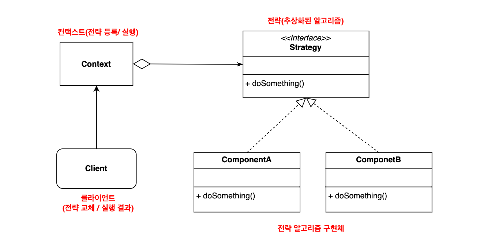
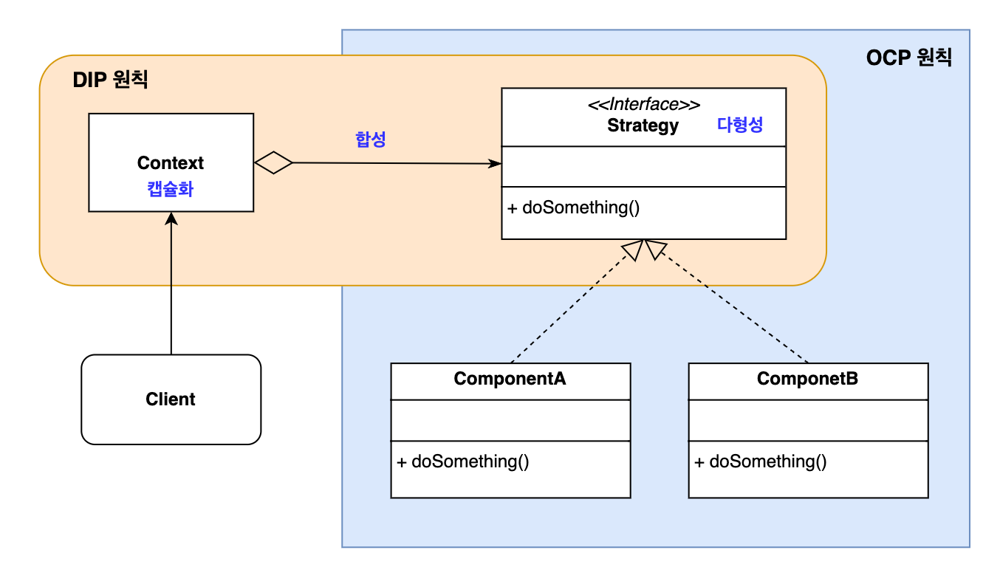
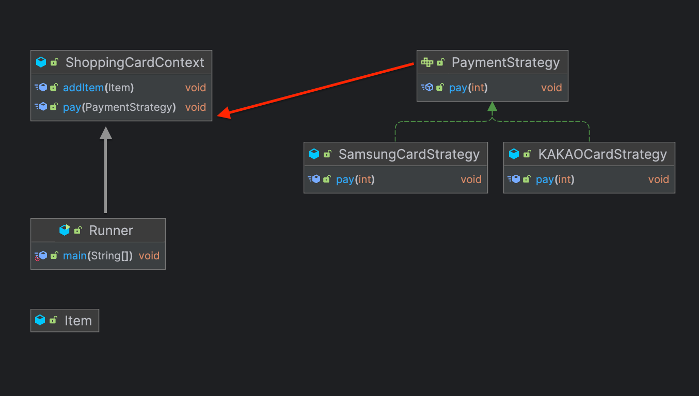

# 전략 패턴

## 1. 전략패턴 이란?
객체의 행위를 바꾸고 싶은 경우 '직접' 수정하지 않고, 전략이라고 불리는 **캡슐화한 알고리즘**을 컨텍스트 안에서 바꿔주면서 상호 교체가 가능하게 만드는 패턴으로, 디자인 패턴중 행위 패턴에 속한다.

> 📌 컨텍스트
> 
> 프로그래밍에서 컨텍스트란 작업이 실행되는 배경으로 해당 작업을 완료하는데 필요한 모든 관련 정보를 캡슐화 한 것이다.


# 2. 전략패턴의 구조



1. Strategy: 모든 전략 알고리즘 구현체에 대한 공용 인터페이스
2. Component: 알고리즘, 행위, 동작을 객체로 구현한 구현체
3. Context: 알고리즘을 실행할 때마다 해당 알고리즘과 연결된 전략 구현체의 메소드를 호출
4. Client: 전략 구현체를 컨텍스트로 전달 하여 전략을 등록하거나 변경하여 전략 알고리즘 구현체의 실행 결과를 다룸


전략 패턴은 `OOP` 기술들의 집합체라고 할 수 있다.
GoF의 다지인 패턴에서는 전략 패턴을 다음과 같이 정의한다.
> 1. 동일 계열의 알고리즘을 정의하고,
> 2. 각각의 알고리즘을 캡슐화하여
> 3. 이들끼리 상호 교환이 가능하도록 만든다.
> 4. 알고리즘을 사용하는 클라이언트와 상관없이 독립적으로
> 5. 알고리즘을 다양하게 변경할 수 있다.



GoF의 다지안 패턴의 정의를 빗대어 설명해보자만

1. 동일 계열의 알고리즘을 정의하고,
   - 전략 구현체로 정의
2. 각각의 알고리즘을 캡슐화
   - 인터페이스로 추상화
3. 이들을 상호 교환이 가능하도록 만든다.
   - 합성(Composition)으로 구성
4. 알고리즘을 사용하는 클라이언트와 상관없이 독립적으로
   - 컨텍스트 객체 수정 없이
5. 알고리즘을 다양하게 변경할 수 있다.
   - 컨텍스트의 메소드를 통해 전략 객체를 변경함으로써 전략 변경 가능

다음과 같이 설명할 수 있다.

## 3. 예제

실무적인 예제로 살펴보자.

쇼핑 카드라는 컨텍스트에 아이템을 담아 삼성 카드 또는 카카오 카드라는 2개의 전략을 사용하여 결제를 진행한다는 내용이다.



```java
public interface PaymentStrategy {

	void pay(int price);
}
```

```java
public class SamsungCardStrategy implements PaymentStrategy {

	private String cardNumber;
	private String password;

	public SamsungCardStrategy(final String cardNumber, final String password) {
		this.cardNumber = cardNumber;
		this.password = password;
	}

	@Override
	public void pay(final int price) {
		System.out.println("삼성 카드를 사용하여 " + price + "원을 결제합니다. ");
	}
}
```

```java
public class KAKAOCardStrategy implements PaymentStrategy {
	private String name;
	private String cardNumber;
	private String cvv;
	private String expiry;

	public KAKAOCardStrategy(final String name, final String cardNumber, final String cvv, final String expiry) {
		this.name = name;
		this.cardNumber = cardNumber;
		this.cvv = cvv;
		this.expiry = expiry;
	}

	@Override
	public void pay(final int price) {
		System.out.println("카카오 페이 카드를 사용하여 " + price + "원을 결제합니다. ");
	}
}
```

```java
public class ShoppingCardContext {

	List<Item> items;

	public ShoppingCardContext() {
		this.items = new ArrayList<>();
	}

	public void addItem(Item item) {
		this.items.add(item);
	}

	public void pay(PaymentStrategy paymentStrategy) {
		int amount = 0;
		for (Item item : items) {
			amount += item.price;
		}
		paymentStrategy.pay(amount);
	}
}
```

```java
class Item {

	public String name;
	public int price;

	public Item(final String name, final int price) {
		this.name = name;
		this.price = price;
	}
}

public class Runner {
   public static void main(String[] args) {
      ShoppingCardContext cart = new ShoppingCardContext();

      Item itemA = new Item("맥북 프로", 300_000);
      Item itemB = new Item("에어팟 프로2", 50_000);

      cart.addItem(itemA);
      cart.addItem(itemB);

      // 카카오 페이 카드로 결제
      cart.pay(new KAKAOCardStrategy("Woo Jaemin", "123456789", "123", "10/01"));

      // 삼성 카드로 결제
      cart.pay(new SamsungCardStrategy("987654321", "12345"));

   }
}
```

## Java에서 전략 패턴이 사용되는 예시

- `Collections`의 `sort()` 메서드에 의해 구현되는 `compare()` 메서드에 이용
- `HttpServlet`의 `service()` 메서드와 모든 `doXXX()` 메서드에 이용
- `Filter`의 `doFilter()` 메서드에 이용

## Spring에서 전략 패턴이 사용되는 예

- `HandlerExceptionResolver`에서 사용되는 예외처리 전략
- `ViewResolver` 의 뷰 렌더링 전략
- `AuthenticationProvider` 스프링 시큐리티의 인증 전략
