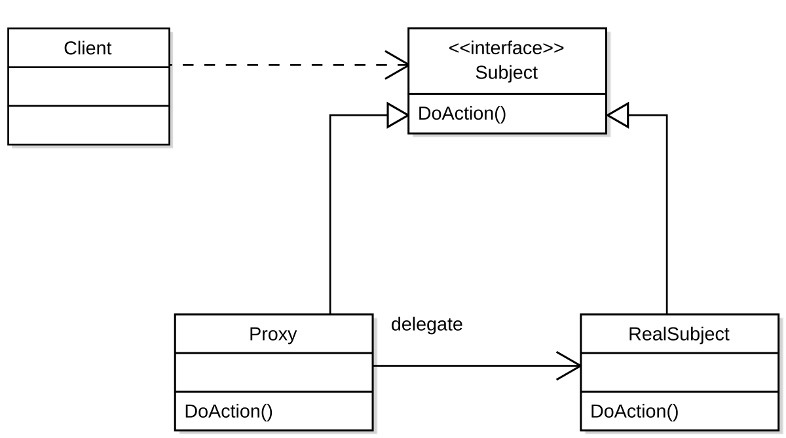

# 프록시 패턴

## 프록시 패턴이란?

프록시 패턴은 대상 원본 객체를 대신하여 처리함으로써 로직의 흐름을 제어하는 행동 패턴이다.
프록시 (Proxy)의 이미는 '대리인' 이라는 의미로 누군가에게 어떤 일을 대신 시키는 것을 의미하는데, 이를 객체 지향 프로그래밍에 접목해보면 클라이언트가 대상 객체를 직접 쓰는게 아니라 중간에 프록시를 거쳐서 쓰는 코드 패턴이다.

근데 그냥 객체를 바로 사용하면 되지, 왜 대리인을 통하는걸까?

그 이유는 대상 클래스가 민감한 정보를 가지고 있거나 인스턴스화 하기에 무겁거나 추가 기능을 붙이고 싶은데, **원본 객체를 수정할 수 없는 상황** 일때를 극복하기 위해서이다.

프록시 패턴을 사용할 경우 대체적으로 다음과 같은 효과를 누릴 수 있다.

### 1. 접근 제어
- 민감한 객체에 대한 접근을 제한하거나 조건을 걸 수 있음
- ex) 인증된 사용자만 실제 서비스에 접근하도록 제한

### 2. 지연 초기화
- 실제 객체 생성 비용이 클 경우, 사용 시점에 객체를 생성할 수 있음

### 3. 로깅
- 메소드 호출과 매개 변수를 인터셉트하고 이를 기록
- AOP 와 유사한 구조

### 4. 원격 객체
- 네트워크 너머의 원격 위치에 있는 객체를 가져와 로컬 객체처럼 다룰 수 있게 함
- ex) Java RMI, gRPC

### 5. 캐싱
- 내부 캐시를 유지하여 데이터가 캐시에 아직 존재하지 않는 경우에만 대상 객체의 작업이 실행되도록 함

### 6. 데이터 유효성 검사
- 입력을 대상 객체로 전달하기 전에 유효성을 검사
