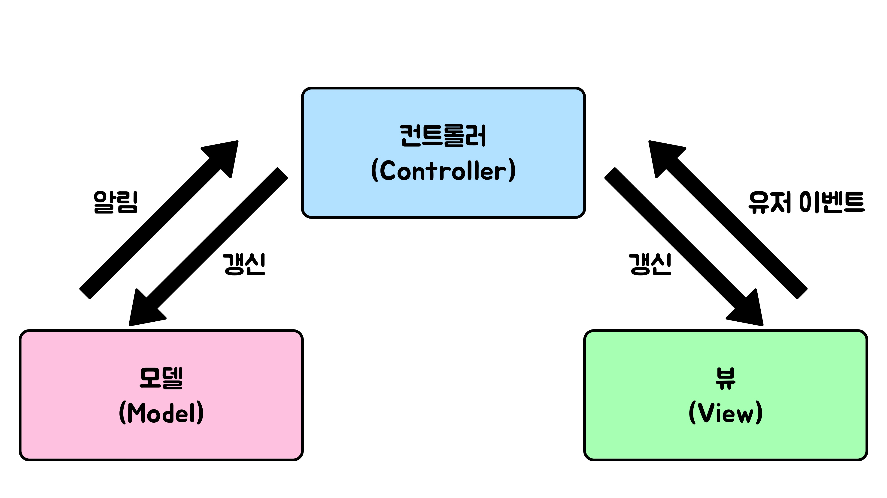

# MVC 패턴

### MVC 패턴이란

MVC 패턴은 모델(Model), 뷰(View), 컨트롤러(Controller)로 애플리케이션을 세 가지 역할로 분리하여 개발하는 디자인 패턴이다.

#### 모델(Model)

애플리케이션의 데이터와 비즈니스 로직을 포함한다. 데이터베이스와 상호 작용, 데이터 처리 및 검증과 같은 작업을 처리하게 된다.

Controller에게 받은 데이터를 조작(가공)하는 역할을 수행한다고 볼 수 있다.

#### 뷰(View)

뷰는 사용자에게 보여지는 UI와 같은 인터페이스이다. 모델에서 데이터를 받아 사용자에게 표시하고, 사용자의 입력을 컨트롤러에 전달한다. 또한, 변경이 발생하면 컨트롤러에 이를 전달해야 한다.

#### 컨트롤러(Controller)

컨트롤러는 하나 이상의 모델과 하나 이상의 뷰를 잇는 다리 역할을 하며 이벤트 등 메인 로직을 담당한다. 또한 모델과 뷰의 생명주기도 관리하며, 모델이나 뷰의 변경 통지를 받으면 이를 해석하여 각각의 구성 요소에 해당 내용에 대해 알려준다.

### 상호작용

1. 사용자가 애플리케이션에서 작업을 수행하면, 뷰는 사용자의 입력을 감지하고, 컨트롤러에 전달한다. 
2. 컨트롤러는 사용자 입력을 처리하고, 적절한 모델 기능을 호출한다.
3. 모델에서 데이터를 검색, 수정 또는 저장하고. 관련된 동작을 수행하거나 필요한 경우 데이터베이스와 상호 작용한다. 
4. 모델은 작업이 완료되면 결과를 컨트롤러에 반환한다. 
5. 컨트롤러는 이를 뷰에 전달한다. 
6. 뷰를 통해 해당 데이터를 사용자에게 보여주게 된다.

### 장점
#### 1. 관심사의 분리
- 각 구성 요소를 세 단계로 분리하여 개발과 유지보수를 용이하게 만들어 준다.

#### 2. 유연성
- 각 구성 요소가 독립적이므로 일부분만 수정하거나 기능 추가, 확장이 쉽다.

#### 3. 재사용성
- 모델과 뷰는 재사용이 가능하기 때문에 다양한 상황에서 같은 로직이나 인터페이스를 사용할 수 있다.

### 단점
어찌됐든 추가적인 구성 요소가 필요한 것이므로 개발하는데 추가적인 비용이 든다. 그리고 요소들간의 의미를 제대로 파악하지 못하면 오히려 코드를 이해하는데 도움을 주지 못할 수 있다.
