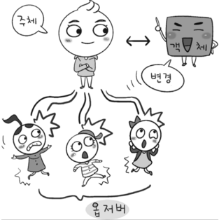
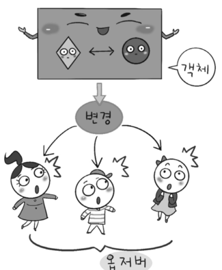
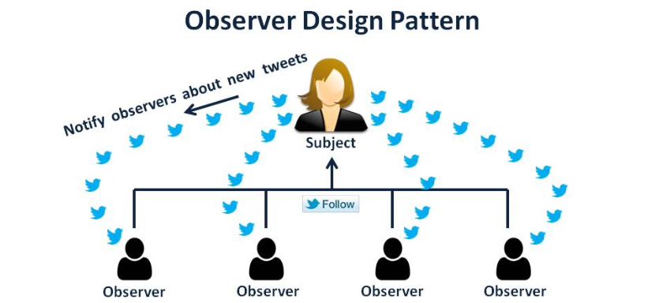
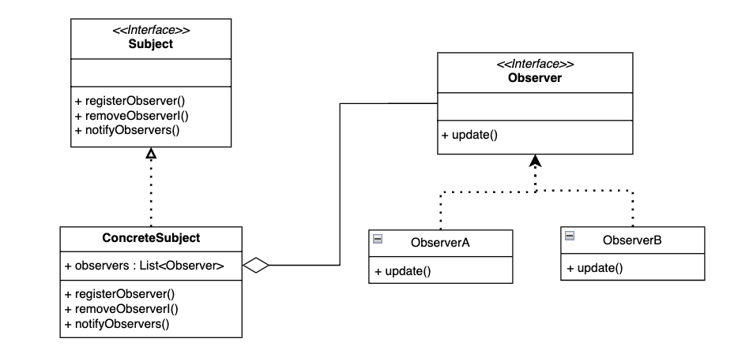
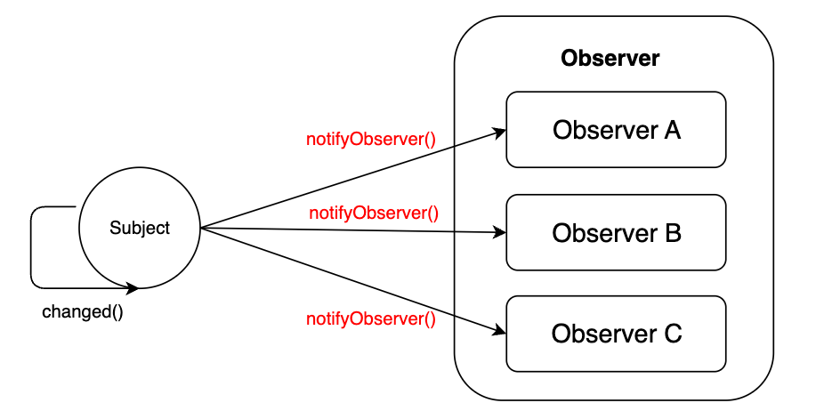

# 옵저버 패턴

## 옵저버 패턴이란?


주체가 어떤 객체(subject)의 상태 변화를 관찰하다가 상태 변화가 있을 때마다 메서드 등을 통해 옵저버 목록에 있는 옵저버들에게 변화를 알려주는 디자인 패턴으로, 행위 패턴에 속한다.

여기서 `주체`란 `상태 변화를 보고 있는 관찰자`이며, `옵저버들`이란 이 객체의 상태 변화에 따라 전달되는 메서드 등을 기반으로 **추가 변경 사항**이 생기는 객체를 의미한다.




또한, 해당 그림처럼 객체와 주체가 합쳐진 방식도 존재한다. 이 방식은 객체가 상태 변경 시 주체의 역할도 수행함으로 옵저버 객체의 메서드를 직접 호출하며, 주체 객체가 옵저버 객체에 직접 알림을 보내는 방식으로 동작한다.



흔히 트위터가 옵저버 패턴을 활용한 서비스라고 생각하면 되는데, 내가 어떤 사람인 주체를 '팔로우' 했다면 그 주체가 포스팅을 올리게 되면 '팔로워'들에게 알림이 가게된다. 이러한 시스템이 옵저버 패턴이다.

즉, 옵저버 패턴은 일대다 의존성을 가진다. 주로 분산 이벤트 핸들링 시스템을 구현하는데 사용되며, Pub/Sub (발행/구독) 모델로도 알려져 있다.

## 옵저버 패턴 구조


Subject는 관찰 대상자이고, Observer는 관찰자 클래스이다.

1. Subject: 관찰 대상자를 정의하는 인터페이스
2. ConcreteSubject: 관찰 당하는 대상자 / 발행자/ 게시자 
   - Observer 들을 리스트로 모아 합성하여 가지고 있음
   - Subject는 관찰자인 Observer들을 등록, 삭제할 수 있음
   - Subject가 상태를 변경하거나 동작을 실행할때, Observer들에게 알림(`notifyObservers`)을 전송

3. Observer: 관찰자들을 묶는 인터페이스

4. ObserverA, ObserverB: 관찰자, 구독자, 알림 수신자
   - Observer들은 Subject가 발행한 알림에 대해 현재 상태 취득
   - Subject의 업데이트에 대해 전후 정보 처리

옵저버 패턴은 합성한 객체를 리스트로 관리하고, 리스트에 있는 옵저버 객체들에게 모두 메서드 위임을 통한 전파 행위를 한다.

## 동작 방식

1. 옵저버 패턴에서는 1개의 관찰 대상자(subject)와 여러개의 관찰자(observer)로 일대다 관계로 구성되어 있다.
2. 옵저버 패턴에서는 관찰 대상자의 상태가 변경이 되면(changed) 이를 옵저버들에게 통보한다. (notifyObserver)
3. 전달받은 옵저버들은 값을 변경하거나, 삭제하는 등 적절히 대응한다.
4. 옵저버들은 언제나 subject의 그룹에서 추가, 삭제될 수 있으며 추가될 경우 정보를 전달받고, 삭제될 경우 정보를 받을 수 없다.

## 특징

### 사용 시기
- 특정 시간, 특정한 케이스에만 다른 객체를 관찰해야 하는 경우
- 대상 객체의 상태가 변경될 때마다 다른 객체의 동작을 트리거해야 할 때
- MVC 패턴에서도 사용됨
  - Model과 View의 관계는 옵저버 패턴의 Subject 와 Observer 역할의 관계에 대응됨
  - 1개의 Model에 여러개의 View가 대응

### 장점
- Subject의 변경 사항을 주기적으로 조회하지 않고, 자동 감지 가능
- 상태가 변경되는 객체와 이를 감지하는 객체간의 관계를 느슨하게 유자 (Loose Coupling)

### 단점
- 알림 순서를 제어할 수 없음
- 자주 구성할 경우 구조와 동작을 알아보기 힘들어져 코드 복잡도 증가
- 옵저버 객체 등록 후 해지하지 않는다면 메모리 누수 발생

## 예제

옵저버 패턴을 적용하여 실제 코드를 작성해보자.
뉴스 발행 시스템으로 `NewsPublisher`는 새로운 뉴스가 발행되면, 해당 뉴스를 구독하고 있는 유저에게 알림을 보내는 시나리오다.

```java
public interface Observer {
	void update(String news);
}

public interface Subject {
	void registerObserver(Observer o);
	void removeObserver(Observer o);
	void notifyObservers(String news);
}
```

```java
public class NewsPublisher implements Subject {

	private List<Observer> observers = new ArrayList<>();

	@Override
	public void registerObserver(final Observer o) {
		observers.add(o);
	}

	@Override
	public void removeObserver(final Observer o) {
		observers.remove(o);
	}

	@Override
	public void notifyObservers(final String news) {
		for (Observer o : observers) {
			o.update(news);
		}
	}

	public void publishNews(String news) {
		System.out.println("뉴스 발행됨: " + news);
		notifyObservers(news);
	}
}
```

```java
public class User implements Observer {

	private String name;

	public User(final String name) {
		this.name = name;
	}

	@Override
	public void update(final String news) {
		System.out.println(name + "님에게 뉴스 알림: " + news);
	}
}
```

```java
public class ObserverPatternExample {
	public static void main(String[] args) {
		NewsPublisher publisher = new NewsPublisher();
		
		// 새로운 뉴스가 발행됨
		publisher.registerObserver(new User("재민"));

		/**
         * 알아서 전파되어 출력됨
		 **/
		
		publisher.registerObserver(new User("우쨈"));

		publisher.publishNews("옵저버 패턴 정식 출시!");
	}
}
```

직접 옵저버 패턴을 구현해보았다. 

다만 공부를 하다보니 알게된게 있는데 자바에서는 원래 `Observable` 과 `Observer`을 자바의 내장 라이브러리로 제공해 옵저버 패턴을 구현할 수 있었다. 하지만 Java 9 부터 해당 API가 deprecated 된 것을 보았다. [참고문서](https://docs.oracle.com/javase/9/docs/api/java/util/Observable.html)

간단하게 정리하면 `Observable`은 `class` 기반 구조라 단일 상속만 허용되는 자바의 특성상 제약이 많고, 상태 변경과 알림이 명확히 연결되어 있지 않으며 알림 순서도 보장되지 않는다고 한다. 따라서 직관성, 유연성, 확장성 모두 고려하여도 현대적인 아키텍처애 바해 구시대적 설계이기 때문에 `Deprecated` 되었다고 한다.

따라서 java.beans에 있는 `PropertyChangeListener`, `PeopertyChangeEvent` 를 사용하는 것을 권장하고 있다.


